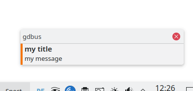

# msg2desktop
a little helperrole for ansible to send short messages to users there are graphical logged in with ansible.

## Installation
- download the code
- copy the code in your ansible roles-directory
- make 3 Environmentvariables in ansible like this:
```
"msg_title": "'my Maintenance Message'",
"msg_msg": "'Please read the newest Message on our Homepage<br><a href=https://myportal>https://myportal</a>'",
"msg_duration": "5000"
```
be patient with the hicommas and commas.  
test it with ansible  
an Examplemessage:  
  
  
  
manual test with:  
`./msg2desktop.sh -t 'my test' -m 'my message' -d 5000`
